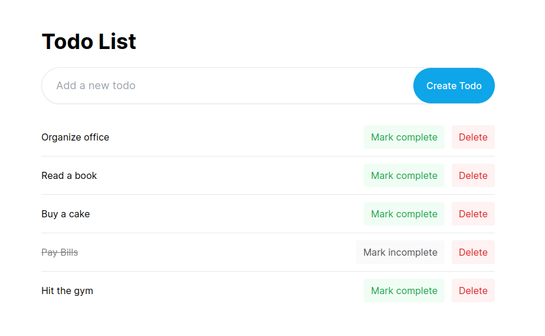
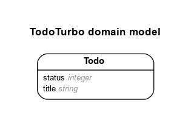

# README

Simple TODO list app using turbo on Rails 7

Live - https://todo.dipenchauhan.com

## Model

Generated by Rails ERD. Run rails erd to regenerate (must have graphviz).

## Ruby version

- ruby 3.1.2p20 (2022-04-12 revision 4491bb740a) [x86_64-linux]
- Rails 7.0.4

## Notes

- rails g scaffold Todo title:string status:integer

## References

- https://web-crunch.com/posts/digging-into-turbo-with-ruby-on-rails-7
- https://dev.to/jamgar/how-to-create-a-comment-and-reply-system-in-ruby-on-rails-10ld
